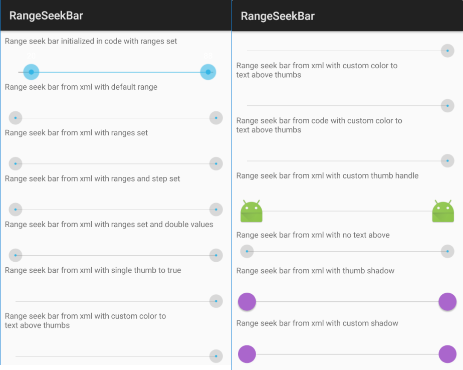

# RangeSeekBar
[](https://travis-ci.org/galcyurio/android-range-seek-bar)

# Introduction

This is fork repository of [android-range-seek-bar](https://github.com/anothem/android-range-seek-bar). I created this repository because the original maintainer is no longer maintain it.

This library provides a SeekBar similar to the default Android one, but with two thumb controls allowing a range to be selected.



# Features and customizations

Main features:

* Two thumbs allowing a range to be selected
* Supports integer ranges and floating point ranges
* Text indicating the selected min and max values on the bar
* Smoother drag animation

Customizations:

* Ability to initialise from XML, with attributes (only tested for Integer and Double, would not support all the original types that the class supports when initialized programmatically)
* Ability to make the range-seek-bar only use one thumb instead of two, with all other feature remaining; can be set from XML.
  This makes it more similar to the default android seekbar, but you still benefit from the other features and very smooth animation.
* Text above thumbs can be disabled and colour can be changed
* Custom icons can be used for the thumbs

# How to run demo

Should be able to import, build and run in Android Studio or from the command line with gradle.
The rangeseekbar-sample shows the available features and customizations in code and XML.

# How to use in your own project

## Setup as Gradle dependency

* Add this in your build.gradle file:

* For latest release: 

```gradle
dependencies {
    compile 'com.github.galcyurio:rangeseekbar:0.5.0'
}
```

# Credits

The android-range-seek-bar started as a fork of the following project: https://code.google.com/p/range-seek-bar/ under Apache license.  
This repository is a fork of the following repository: https://github.com/anothem/android-range-seek-bar under Apache license and Created Commons license.

# License

The images are licensed under Creative Commons ( http://creativecommons.org/licenses/by/3.0/ ). The originals are provided in the original project ( https://code.google.com/p/range-seek-bar/ ) and seek_thumb_disabled.png is added by us.


````copyright
Copyright 2016 Alex Florescu

Licensed under the Apache License, Version 2.0 (the "License");
you may not use this file except in compliance with the License.
You may obtain a copy of the License at

   http://www.apache.org/licenses/LICENSE-2.0

Unless required by applicable law or agreed to in writing, software
distributed under the License is distributed on an "AS IS" BASIS,
WITHOUT WARRANTIES OR CONDITIONS OF ANY KIND, either express or implied.
See the License for the specific language governing permissions and
limitations under the License.
````